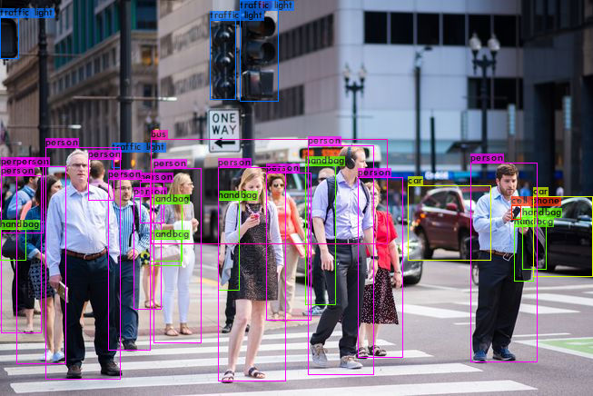

# YOLOv4-Cloud-Tutorial
This repository walks you through how to Build, Train and Run YOLOv4 Object Detections with Darknet in the Cloud through Google Colab.

To follow along with the exact tutorial upload this entire repository to your Google Drive home folder. Then follow along with the notebook by opening it within Google Colab.

Watch a step-by-step walkthrough tutorial of the code for pre-trained YOLOv4: https://www.youtube.com/watch?v=mKAEGSxwOAY

Watch a step-by-step walkthrough tutorial of the code for training your own Custom Object Detector: https://www.youtube.com/watch?v=mmj3nxGT2YQ

Here is the Colab Notebook for showing pre-trained YOLOv4 Object Detector on over 80 classes and how to customize outputs etc.: https://colab.research.google.com/drive/12QusaaRj_lUwCGDvQNfICpa7kA7_a2dE?usp=sharing

Here is the Colab Notebook for showing how to TRAIN CUSTOM YOLOv4 OBJECT DETECTOR: https://colab.research.google.com/drive/1_GdoqCJWXsChrOiY8sZMr_zbr_fH-0Fg?usp=sharing

Cheers!
